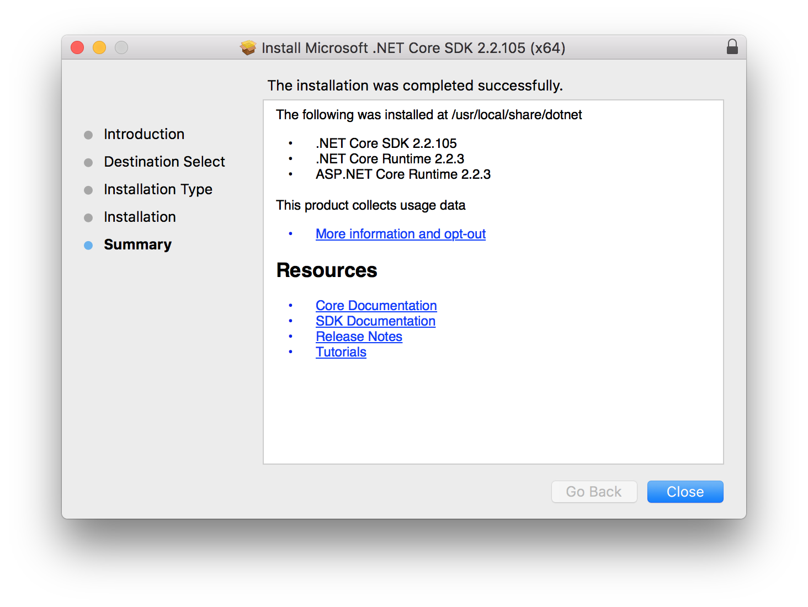
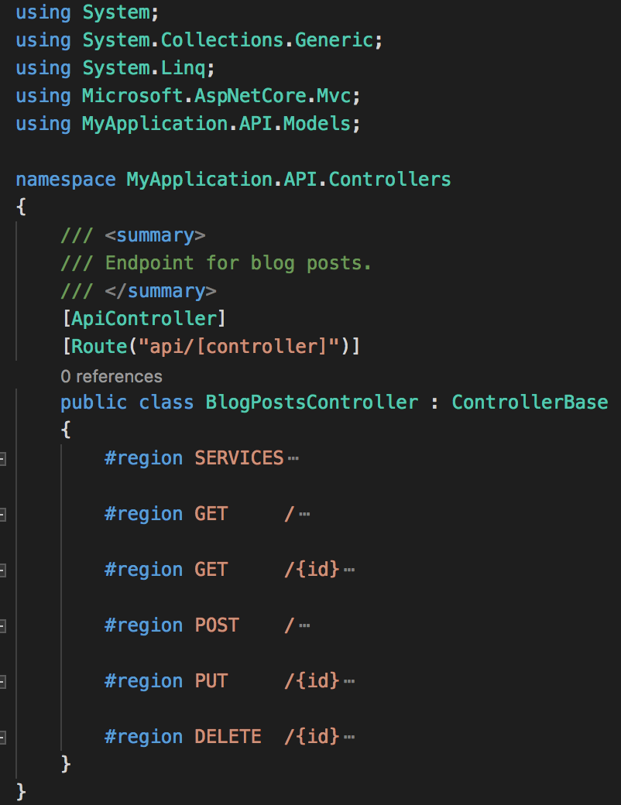

# Building multilayered .NET applications the right way
Entire blogs are written about how to use a specific library or showcasing a new piece of technology.
Much less is written about how to structure your application. In this write-up, we begin at our web layer
and build up to a multilayered .NET-application.
When we're finished we'll be having an application consisting of three main archectural layers:
- Database
- Services
- Web API

If you are only interested in the result, by all means fetch the latest master branch. If you want to know how we get there, continue reading.

## Prerequisites
To get started with .NET core, you need to download it from [dotnet.microsoft.com](https://dotnet.microsoft.com/download).
After downloading and installing everything, verify the installation was succesful. Open to a terminal window and type `dotnet --version`.
On the time of writing, this returns `2.2.105`.



## Creating an API
To start of we're creating a single API-project. When this step is finished we will have:
- A single project in our solution
- CRUD actions on a controller level for a data model
- Validation on these CRUD actions
- Installed Swagger UI so we call our controller within the browser
- Created unit tests for our controller

If you're using git, copy the `.gitignore` from the (dotnet core github)[https://github.com/dotnet/core/blob/master/.gitignore] and paste it in the root of the application. Having an incomplete gitignore-file will result in compiled binaries getting added to git.

### Initialize API
The naming convension for projects is `$"{NameOfTheApplication}.{Layer}"`.
Using this convension we will name our API-folder `MyApplication.API`.
The commands below will create a folder, initialize a .NET core webapi, and run the project on port 5000 (http) and 5001 (https). Browsing to (https://localhost:5001/api/values)[https://localhost:5001/api/values] will show a list of two values.
```
mkdir MyApplication.API && cd MyApplication.API
dotnet new webapi
dotnet run watch
```

### Creating a Data Model and CRUD actions
Inside our API-project we're creating a new folder `Models`.
This folder will hold all the models we use for data we're getting from the user and returning to the user.
For this example we will create a models for a `BlogPost`-entity. 

```csharp
namespace MyApplication.API.Models
{
    /// <summary>
    /// A blog post entity.
    /// </summary>
    public class BlogPost
    {
        /// <summary>
        /// Id of the blog post.
        /// </summary>
        public int Id { get; set; }

        /// <summary>
        ///  Title of the blog post.
        /// </summary>
        public string Title { get; set; }

        /// <summary>
        /// The text of the blog post.
        /// </summary>
        public string Text { get; set; }
    }
}
```

For each entity we create a subfolder in `MyApplication.API.Models`.
Even though every model is in a seperate subfolder the namespace of the models should be `MyApplication.API.Models`.
Changing the namespace will greatly reduce the amount of usings we're going to need further down the road.

Now that we have a model, let's create a controller for it.
Inside `MyApplication.Controllers` we add a new file named `BlogPostsController`. Note the pluralisation of the name.

```csharp
using System.Collections.Generic;
using System.Linq;
using Microsoft.AspNetCore.Mvc;
using MyApplication.API.Models;

namespace MyApplication.API.Controllers
{
    /// <summary>
    /// Endpoint for blog posts.
    /// </summary>
    [ApiController]
    [Route("api/[controller]")]
    public class BlogPostsController : ControllerBase
    {
        private readonly List<BlogPost> _blogPosts = new List<BlogPost>()
        {
            new BlogPost() { Id = 1, Title = "Title 1", Text = "Text 1" },
            new BlogPost() { Id = 2, Title = "Title 2", Text = "Text 2" },
        };

        #region GET     /
        [HttpGet]
        public ActionResult<IEnumerable<BlogPost>> Get()
        {
            return _blogPosts;
        }
        #endregion
        
        #region GET     /{id}
        [HttpGet("{id}")]
        public ActionResult<BlogPost> Get(int id)
        {
            var blogPost = _blogPosts.FirstOrDefault(x => x.Id == id);
            if (blogPost == null) {
                return NotFound();
            }
            return blogPost;
        }
        #endregion
    }
}
```

For the create and update actions, we need need new models representing the user input. We create a `CreateBlogPost` and an `UpdateBlogPost`. For the sake of example we can't edit the title of a blog post after creation.

```csharp
namespace MyApplication.API.Models
{
    public class CreateBlogPost
    {
        [Required]
        [MaxLength(40)]
        public string Title { get; set; }

        [Required]
        public string Text { get; set; }
    }
    public class UpdateBlogPost
    {
        [Required]
        public string Text { get; set; }
    }
}
```
The create/update/delete functions look like this. Since we've added attributes on our CreateBlogPost and UpdateBlogPost there is no need to check validations here.

```csharp
using System;
using System.Collections.Generic;
using System.Linq;
using Microsoft.AspNetCore.Mvc;
using MyApplication.API.Models;

namespace MyApplication.API.Controllers
{
    /// <summary>
    /// Endpoint for blog posts.
    /// </summary>
    [ApiController]
    [Route("api/[controller]")]
    public class BlogPostsController : ControllerBase
    {
        static int _blogPostId = 0;
        static List<BlogPost> _blogPosts = new List<BlogPost>()
        {
            new BlogPost() { Id = ++_blogPostId, Title = "Title 1", Text = "Text 1" },
            new BlogPost() { Id = ++_blogPostId, Title = "Title 2", Text = "Text 2" },
        };

        // ...

        #region POST    /
        [HttpPost]
        public void Create([FromBody] CreateBlogPost createBlogPost)
        {
            var newBlogPost = new BlogPost()
            {
                Id = ++_blogPostId,
                Title = createBlogPost.Title,
                Text = createBlogPost.Text,
            };
            _blogPosts.Add(newBlogPost);
        }
        #endregion

        #region PUT     /{id}
        [HttpPut("{id}")]
        public ActionResult<BlogPost> Update(
            int id,
            [FromBody] UpdateBlogPost updatedBlogPost
        )
        {
            try
            {
                var blogPost = _blogPosts.FirstOrDefault(x => x.Id == id);
                if (blogPost == null) { throw new Exception("NOT_FOUND"); }
                blogPost.Text = updatedBlogPost.Text;
                return blogPost;
            }
            catch (Exception ex)
            {
                if (ex.Message == "NOT_FOUND")
                {
                    return NotFound();
                }
                return BadRequest();
            }
        }
        #endregion

        #region DELETE  /{id}
        [HttpDelete("{id}")]
        public ActionResult Delete(int id)
        {
            try
            {
                var blogPost = _blogPosts.FirstOrDefault(x => x.Id == id);
                if (blogPost == null) { throw new Exception("NOT_FOUND"); }
                _blogPosts.Remove(blogPost);
                return Ok();
            }
            catch (Exception ex)
            {
                if (ex.Message == "NOT_FOUND")
                {
                    return NotFound();
                }
                return BadRequest();
            }
        }
        #endregion
    }
}
```

The reason every call is wrapped in a `#region` is to help us list all API routes in this controller. When minimising every region, our controller looks like a nice overview of all routes.



To finish of the API layer, we're going to add Swagger UI. Swagger is going to help us document our API layer and ables us to test calls inside the browser. Installing Swagger UI is easy using Nuget.